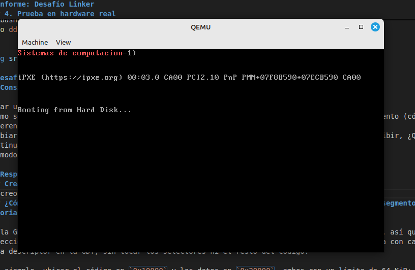

# Desafio UEFI y coreboot

## Consigna

- ¿Qué es UEFI? ¿como puedo usarlo? Mencionar además una función a la que podría llamar usando esa dinámica.
- ¿Menciona casos de bugs de UEFI que puedan ser explotados?
- ¿Qué es Converged Security and Management Engine (CSME), the Intel Management Engine BIOS Extension (Intel MEBx).?
- ¿Qué es coreboot ? ¿Qué productos lo incorporan ?¿Cuales son las ventajas de su utilización?

## Respuestas

### 1. UEFI (Unified Extensible Firmware Interface)

Es el estándar moderno que reemplaza al antiguo BIOS. Es más complejo y que actúa como puente entre el hardware y el sistema operativo.

- **¿Cómo usarlo?**: Se puede interactuar con el durante el arranque. Se puede acceder al mismo incluso desde el sistema operativo.
- **Dinámica de llamadas**: UEFI ofrece **Runtime Services**, funciones que permanecen disponibles incluso después de que el sistema operativo ha tomado el control.
- **Función ejemplo**: `GetVariable`. Esta función permite al sistema operativo consultar variables almacenadas de la UEFI que estna en la NVRAM.

### 2. Bugs de UEFI y su Explotación

La explotación de la UEFI radica en su nivel de privilecio, que es alto.

- **LogoFAIL (2023)**: Vulnerabilidad en los _parsers_ de imágenes. Al reemplazar el logo del fabricante por una imagen maliciosa, se puede ejecutar código durante el arranque, antes de que se activen las defensas del SO.
- **PixieFail (2024)**: Un conjunto de 9 vulnerabilidades en el stack de red de UEFI que permite la ejecución de código remoto si la computadora intenta bootear desde la red.

### 3. Intel CSME e Intel MEBx

- **Intel CSME (Motor de Gestión y Seguridad Convergente)**: Es un subsistema de seguridad basado en un microcontrolador que vive dentro del chipset. Corre un sistema operativo independiente y se encarga de tareas de criptografía, autenticación y administración remota.
- **Intel MEBx (Extension BIOS del Motor de Administración)**: Es el módulo de configuración que aparece en el menú del BIOS/UEFI. Permite configurar los parámetros del CSME, como el acceso remoto y las credenciales de administración.

### 4. Coreboot

Es un proyecto de firmware de código abierto diseñado para reemplazar los BIOS/UEFI propietarios de los fabricantes. Su objetivo es inicializar el hardware con el mínimo de código posible.

- **Productos que lo incorporan**:
  - Laptops de **System76** y **Purism**.
  - Casi todas las **Chromebooks** de Google.
  - Hardware específico de servidores y firewalls (como Protectli o PCEngines).
- **Ventajas**:
  - **Velocidad**: Al eliminar procesos innecesarios del firmware propietario, el tiempo de booteo se reduce drásticamente.
  - **Seguridad y Auditoría**: El código es abierto y puede ser revisado por cualquiera. Permite "limpiar" o limitar funciones del Intel Management Engine.
  - **Flexibilidad**: Podés elegir el _payload_ (qué querés que cargue después), desde una implementación de UEFI hasta un kernel de Linux directamente.

# Desafio Linker

## Consigna

Crear un documento donde respondan a las siguientes preguntas

- ¿Que es un linker? ¿que hace ?
- ¿Que es la dirección que aparece en el script del linker?¿Porqué es necesaria ?
- Compare la salida de objdump con hd, verifique donde fue colocado el programa dentro de la imagen.
- Grabar la imagen en un pendrive y probarla en una pc y subir una foto
- ¿Para que se utiliza la opción --oformat binary en el linker?

## Respuestas

Markdown

# Informe: Desafío Linker

### 1. ¿Qué es un linker y qué hace?

El linker es un archivo de texto utilizado durante la compilación, para dirigir al enlazador (linker) sobre cómo organizar las secciones de código y datos en la memoria física del dispositivo. Define la distribución exacta de memoria ordenando dónde se colocan el código, variables inicializadas y tablas de vectores, asegurando que el binario final sea ejecutable
Entre sus funciones esta, asignar memoria, organizar secciones, definir simbolos especiales.
En resumen transforma archivos objeto reubicables en un ejecutable binario absoluto con una estructura de memoria específica.

### 2. ¿Qué es la dirección que aparece en el script del linker? ¿Por qué es necesaria?

En el script de linker provisto (`link.ld`), aparece la instrucción `. = 0x7c00;`. Esta dirección representa el **Location Counter** o dirección base de carga.

- **Por qué es necesaria:** En arquitectura x86, el BIOS siempre carga el primer sector del disco (MBR) en la dirección física de memoria **0x7C00**. El linker necesita saber esto de antemano para calcular correctamente las direcciones de las etiquetas (labels) y variables. Si no se especificara, el linker podría asumir que el código empieza en `0x0000`, y cuando el programa intente acceder a una variable en RAM, buscará en una dirección incorrecta, provocando un fallo del sistema.

### 3. Comparación de salida: `objdump` vs `hd`

Al realizar la comparación de la imagen generada, se observa lo siguiente:

- **`objdump -D`**: Esta herramienta muestra el contenido del archivo desde una perspectiva lógica. Es lo que el procesador ejecutara una vez que el código esté cargado en la RAM.
-

```zsh
objdump -D -b binary -m i386 -M intel,16bit main.img

main.img:     file format binary


Disassembly of section .data:

00000000 <.data>:
   0:   be 0f 7c b4 0e          mov    esi,0xeb47c0f
   5:   ac                      lods   al,BYTE PTR ds:[esi]
   6:   08 c0                   or     al,al
   8:   74 04                   je     0xe
   a:   cd 10                   int    0x10
   c:   eb f7                   jmp    0x5
   e:   f4                      hlt
   f:   68 65 6c 6c 6f          push   0x6f6c6c65
  14:   20 77 6f                and    BYTE PTR [edi+0x6f],dh
  17:   72 6c                   jb     0x85
  19:   64 00 66 2e             add    BYTE PTR fs:[esi+0x2e],ah
  1d:   0f 1f 84 00 00 00 00    nop    DWORD PTR [eax+eax*1+0x0]
  24:   00
  25:   66 2e 0f 1f 84 00 00    nop    WORD PTR cs:[eax+eax*1+0x0]
  2c:   00 00 00
  2f:   66 2e 0f 1f 84 00 00    nop    WORD PTR cs:[eax+eax*1+0x0]
  36:   00 00 00
  39:   66 2e 0f 1f 84 00 00    nop    WORD PTR cs:[eax+eax*1+0x0]
  40:   00 00 00
  43:   66 2e 0f 1f 84 00 00    nop    WORD PTR cs:[eax+eax*1+0x0]
  4a:   00 00 00
  4d:   66 2e 0f 1f 84 00 00    nop    WORD PTR cs:[eax+eax*1+0x0]
  54:   00 00 00
  57:   66 2e 0f 1f 84 00 00    nop    WORD PTR cs:[eax+eax*1+0x0]
  5e:   00 00 00
  61:   66 2e 0f 1f 84 00 00    nop    WORD PTR cs:[eax+eax*1+0x0]
  68:   00 00 00
  6b:   66 2e 0f 1f 84 00 00    nop    WORD PTR cs:[eax+eax*1+0x0]
  72:   00 00 00
  75:   66 2e 0f 1f 84 00 00    nop    WORD PTR cs:[eax+eax*1+0x0]
  7c:   00 00 00
  7f:   66 2e 0f 1f 84 00 00    nop    WORD PTR cs:[eax+eax*1+0x0]
  86:   00 00 00
  89:   66 2e 0f 1f 84 00 00    nop    WORD PTR cs:[eax+eax*1+0x0]
  90:   00 00 00
  93:   66 2e 0f 1f 84 00 00    nop    WORD PTR cs:[eax+eax*1+0x0]
  9a:   00 00 00
  9d:   66 2e 0f 1f 84 00 00    nop    WORD PTR cs:[eax+eax*1+0x0]
  a4:   00 00 00
  a7:   66 2e 0f 1f 84 00 00    nop    WORD PTR cs:[eax+eax*1+0x0]
  ae:   00 00 00
  b1:   66 2e 0f 1f 84 00 00    nop    WORD PTR cs:[eax+eax*1+0x0]
  b8:   00 00 00
  bb:   66 2e 0f 1f 84 00 00    nop    WORD PTR cs:[eax+eax*1+0x0]
  c2:   00 00 00
  c5:   66 2e 0f 1f 84 00 00    nop    WORD PTR cs:[eax+eax*1+0x0]
  cc:   00 00 00
  cf:   66 2e 0f 1f 84 00 00    nop    WORD PTR cs:[eax+eax*1+0x0]
  d6:   00 00 00
  d9:   66 2e 0f 1f 84 00 00    nop    WORD PTR cs:[eax+eax*1+0x0]
  e0:   00 00 00
  e3:   66 2e 0f 1f 84 00 00    nop    WORD PTR cs:[eax+eax*1+0x0]
  ea:   00 00 00
  ed:   66 2e 0f 1f 84 00 00    nop    WORD PTR cs:[eax+eax*1+0x0]
  f4:   00 00 00
  f7:   66 2e 0f 1f 84 00 00    nop    WORD PTR cs:[eax+eax*1+0x0]
  fe:   00 00 00
 101:   66 2e 0f 1f 84 00 00    nop    WORD PTR cs:[eax+eax*1+0x0]
 108:   00 00 00
 10b:   66 2e 0f 1f 84 00 00    nop    WORD PTR cs:[eax+eax*1+0x0]
 112:   00 00 00
 115:   66 2e 0f 1f 84 00 00    nop    WORD PTR cs:[eax+eax*1+0x0]
 11c:   00 00 00
 11f:   66 2e 0f 1f 84 00 00    nop    WORD PTR cs:[eax+eax*1+0x0]
 126:   00 00 00
 129:   66 2e 0f 1f 84 00 00    nop    WORD PTR cs:[eax+eax*1+0x0]
 130:   00 00 00
 133:   66 2e 0f 1f 84 00 00    nop    WORD PTR cs:[eax+eax*1+0x0]
 13a:   00 00 00
 13d:   66 2e 0f 1f 84 00 00    nop    WORD PTR cs:[eax+eax*1+0x0]
 144:   00 00 00
 147:   66 2e 0f 1f 84 00 00    nop    WORD PTR cs:[eax+eax*1+0x0]
 14e:   00 00 00
 151:   66 2e 0f 1f 84 00 00    nop    WORD PTR cs:[eax+eax*1+0x0]
 158:   00 00 00
 15b:   66 2e 0f 1f 84 00 00    nop    WORD PTR cs:[eax+eax*1+0x0]
 162:   00 00 00
 165:   66 2e 0f 1f 84 00 00    nop    WORD PTR cs:[eax+eax*1+0x0]
 16c:   00 00 00
 16f:   66 2e 0f 1f 84 00 00    nop    WORD PTR cs:[eax+eax*1+0x0]
 176:   00 00 00
 179:   66 2e 0f 1f 84 00 00    nop    WORD PTR cs:[eax+eax*1+0x0]
 180:   00 00 00
 183:   66 2e 0f 1f 84 00 00    nop    WORD PTR cs:[eax+eax*1+0x0]
 18a:   00 00 00
 18d:   66 2e 0f 1f 84 00 00    nop    WORD PTR cs:[eax+eax*1+0x0]
 194:   00 00 00
 197:   66 2e 0f 1f 84 00 00    nop    WORD PTR cs:[eax+eax*1+0x0]
 19e:   00 00 00
 1a1:   66 2e 0f 1f 84 00 00    nop    WORD PTR cs:[eax+eax*1+0x0]
 1a8:   00 00 00
 1ab:   66 2e 0f 1f 84 00 00    nop    WORD PTR cs:[eax+eax*1+0x0]
 1b2:   00 00 00
 1b5:   66 2e 0f 1f 84 00 00    nop    WORD PTR cs:[eax+eax*1+0x0]
 1bc:   00 00 00
 1bf:   66 2e 0f 1f 84 00 00    nop    WORD PTR cs:[eax+eax*1+0x0]
 1c6:   00 00 00
 1c9:   66 2e 0f 1f 84 00 00    nop    WORD PTR cs:[eax+eax*1+0x0]
 1d0:   00 00 00
 1d3:   66 2e 0f 1f 84 00 00    nop    WORD PTR cs:[eax+eax*1+0x0]
 1da:   00 00 00
 1dd:   66 2e 0f 1f 84 00 00    nop    WORD PTR cs:[eax+eax*1+0x0]
 1e4:   00 00 00
 1e7:   66 2e 0f 1f 84 00 00    nop    WORD PTR cs:[eax+eax*1+0x0]
 1ee:   00 00 00
 1f1:   66 2e 0f 1f 84 00 00    nop    WORD PTR cs:[eax+eax*1+0x0]
 1f8:   00 00 00
 1fb:   0f 1f 00                nop    DWORD PTR [eax]
 1fe:   55                      push   ebp
 1ff:   aa                      stos   BYTE PTR es:[edi],al
```

- **`hd` (Hexdump)**: Muestra el contenido binario crudo del archivo tal como está guardado en el disco.

```zsh
➜  TP3 git:(master) ✗ hd main.img
00000000  be 0f 7c b4 0e ac 08 c0  74 04 cd 10 eb f7 f4 68  |..|.....t......h|
00000010  65 6c 6c 6f 20 77 6f 72  6c 64 00 66 2e 0f 1f 84  |ello world.f....|
00000020  00 00 00 00 00 66 2e 0f  1f 84 00 00 00 00 00 66  |.....f.........f|
00000030  2e 0f 1f 84 00 00 00 00  00 66 2e 0f 1f 84 00 00  |.........f......|
00000040  00 00 00 66 2e 0f 1f 84  00 00 00 00 00 66 2e 0f  |...f.........f..|
00000050  1f 84 00 00 00 00 00 66  2e 0f 1f 84 00 00 00 00  |.......f........|
00000060  00 66 2e 0f 1f 84 00 00  00 00 00 66 2e 0f 1f 84  |.f.........f....|
00000070  00 00 00 00 00 66 2e 0f  1f 84 00 00 00 00 00 66  |.....f.........f|
00000080  2e 0f 1f 84 00 00 00 00  00 66 2e 0f 1f 84 00 00  |.........f......|
00000090  00 00 00 66 2e 0f 1f 84  00 00 00 00 00 66 2e 0f  |...f.........f..|
000000a0  1f 84 00 00 00 00 00 66  2e 0f 1f 84 00 00 00 00  |.......f........|
000000b0  00 66 2e 0f 1f 84 00 00  00 00 00 66 2e 0f 1f 84  |.f.........f....|
000000c0  00 00 00 00 00 66 2e 0f  1f 84 00 00 00 00 00 66  |.....f.........f|
000000d0  2e 0f 1f 84 00 00 00 00  00 66 2e 0f 1f 84 00 00  |.........f......|
000000e0  00 00 00 66 2e 0f 1f 84  00 00 00 00 00 66 2e 0f  |...f.........f..|
000000f0  1f 84 00 00 00 00 00 66  2e 0f 1f 84 00 00 00 00  |.......f........|
00000100  00 66 2e 0f 1f 84 00 00  00 00 00 66 2e 0f 1f 84  |.f.........f....|
00000110  00 00 00 00 00 66 2e 0f  1f 84 00 00 00 00 00 66  |.....f.........f|
00000120  2e 0f 1f 84 00 00 00 00  00 66 2e 0f 1f 84 00 00  |.........f......|
00000130  00 00 00 66 2e 0f 1f 84  00 00 00 00 00 66 2e 0f  |...f.........f..|
00000140  1f 84 00 00 00 00 00 66  2e 0f 1f 84 00 00 00 00  |.......f........|
00000150  00 66 2e 0f 1f 84 00 00  00 00 00 66 2e 0f 1f 84  |.f.........f....|
00000160  00 00 00 00 00 66 2e 0f  1f 84 00 00 00 00 00 66  |.....f.........f|
00000170  2e 0f 1f 84 00 00 00 00  00 66 2e 0f 1f 84 00 00  |.........f......|
00000180  00 00 00 66 2e 0f 1f 84  00 00 00 00 00 66 2e 0f  |...f.........f..|
00000190  1f 84 00 00 00 00 00 66  2e 0f 1f 84 00 00 00 00  |.......f........|
000001a0  00 66 2e 0f 1f 84 00 00  00 00 00 66 2e 0f 1f 84  |.f.........f....|
000001b0  00 00 00 00 00 66 2e 0f  1f 84 00 00 00 00 00 66  |.....f.........f|
000001c0  2e 0f 1f 84 00 00 00 00  00 66 2e 0f 1f 84 00 00  |.........f......|
000001d0  00 00 00 66 2e 0f 1f 84  00 00 00 00 00 66 2e 0f  |...f.........f..|
000001e0  1f 84 00 00 00 00 00 66  2e 0f 1f 84 00 00 00 00  |.......f........|
000001f0  00 66 2e 0f 1f 84 00 00  00 00 00 0f 1f 00 55 aa  |.f............U.|
00000200
```

¿Donde fue colocada la imagen?

La arquitectura x86 usa el formato little endian, esta almacena el byte menos significativo de un dato en la dirección de memoria más baja, lo que provoca que al visualizar en hexadecimal los valores parezcan estar "al revés".
Esperamos ver la dirección `0x7C00` especificada en el `link.ld`, que es el estándar físico donde el BIOS carga el MBR en la RAM para iniciar el arranque.
La primer instrucción del `main.S` es:
` mov $msg, %si`
En la salida de objdump, esta dirección se manifiesta en el cálculo de etiquetas, como ver un puntero a `0x7C0F` en lugar de `0x000F`, confirmando que el Linker reubicó el código:
`   0:   be 0f 7c b4 0e          mov    esi,0xeb47c0f`
Mientras que en hd (perspectiva física), se ve codificada dentro de la propia instrucción mov, observando los bytes `0f 7c` en el orden de almacenamiento real del procesador.
`00000000  be 0f 7c b4 0e ac 08 c0  74 04 cd 10 eb f7 f4 68  |..|.....t......h|`

### 4. Prueba en hardware real

Para grabar la imagen en el pendrive se utiliza el comando `dd` (Data Duplicator), que escribe el archivo bit a bit directamente sobre el dispositivo físico:

```bash
sudo dd if=main.img of=/dev/sdd1 bs=512 count=1
```


# Desafío final: Modo protegido

## Consigna

Crear un código assembler que pueda pasar a modo protegido (sin macros).
¿Cómo sería un programa que tenga dos descriptores de memoria diferentes, uno para cada segmento (código y datos) en espacios de memoria diferenciados?
Cambiar los bits de acceso del segmento de datos para que sea de solo lectura, intentar escribir, ¿Que sucede? ¿Que debería suceder a continuación? (revisar el teórico) Verificarlo con gdb.
En modo protegido, ¿Con qué valor se cargan los registros de segmento ? ¿Porque?

Se creo el codigo `ModoProtegido/src/main.S`. Que imprime "Sistemas de computacion" en rojo.



## Respuestas

### ¿Cómo sería un programa que tenga dos descriptores de memoria diferentes, uno para cada segmento (código y datos) en espacios de memoria diferenciados?

El `main.S` tiene una GDT con dos descriptores que apuntan a regiones físicas distintas y no solapadas:

```asm
gdt_start:
    .quad 0x0000000000000000   /* null */
    .quad 0x00409A000000FFFF   /* Code: base=0x00000000, límite=0xFFFF, exec/read */
    .quad 0x0040920B80000FFF   /* Data: base=0x000B8000, límite=0x0FFF, read/write */
gdt_end:
```

| Descriptor | Selector | Base         | Límite              | Tipo       | Cubre                |
| ---------- | -------- | ------------ | ------------------- | ---------- | -------------------- |
| Code       | `0x08`   | `0x00000000` | `0x00FFFF` (64 KiB) | exec/read  | sector de boot       |
| Data       | `0x10`   | `0x000B8000` | `0x000FFF` (4 KiB)  | read/write | memoria de video VGA |

Como CS (Coding segment) y DS (Data segment) tienen bases distintas, hay que ser explícito con qué segmento se usa al leer y al escribir:

- El string `"Sistemas de computacion"` vive en `.text` (linker lo coloca a partir de `0x7c00`), o sea **dentro del code segment**. Para leerlo hay que usar override `%cs:` en el `mov`:
  ```asm
  mov %cs:(%esi), %al   /* lee el char a través de CS */
  ```
- VGA es accesible directamente como `(%edi)` con offset 0, porque la base de DS ya es `0xB8000`:
  ```asm
  mov %al, (%edi)       /* DS:0 = 0xB8000 = primera celda de VGA */
  ```

Los selectores (`CODE_SEG = 0x08`, `DATA_SEG = 0x10`) y la carga en CS/DS/ES/SS no cambian: la separación física la hace la unidad de segmentación al sumar la base del descriptor correspondiente a cada acceso.

## Cambiar los bits de acceso del segmento de datos para que sea de solo lectura, intentar escribir, ¿Que sucede? ¿Que debería suceder a continuación?

### Cambio en el descriptor

Para cambiar el descriptor de manera tal que el segmento de datos pase de escritura/lectura a solo lectura pasamos el byte asociado al acceso de 0x92 a 0x90.

```asm
/* Antes (read/write) */
.quad 0x0040920B80000FFF   /* access = 0x92 = 1001 0010 -> RW=1 */

/* Después (read-only) */
.quad 0x0040900B80000FFF   /* access = 0x90 = 1001 0000 -> RW=0 */
```

### Qué sucede al intentar escribir

El primer `mov %al, (%edi)` del `print_loop` intenta escribir en `DS:0` (= `0xB8000`). Como el descriptor de DS es ahora read-only, la unidad de segmentación rechaza la escritura y la CPU lanza una **excepción `#GP` (General Protection Fault)** con error code asociado al selector violado.

1. **`#GP`**: la CPU intenta entregarla → no encuentra handler en la IDT (la IDT está vacía).
2. **`#DF` (Double Fault)**: se dispara al fallar la entrega del `#GP` → tampoco hay handler.
3. **Triple Fault**: al fallar la entrega del `#DF`, la CPU se resetea.

Hacemos la prueba con QEMU y gdb, mediante el makefile con tres targets:

- make: para compilar
- make debug: Inicializa QEMU, expone puerto y detiene su ejecución en la primer linea
- make gdb: gdb se conecta a QEMU mediante el puerto 1234 y especifica arquitectura

Depuramos: agregamos un break point en la primer instrucción del MBR y ejecutamos hasta que llegue alli:
`break *0x7c00`
`continue`
Ponemos un breakpoint luego de la instrucción `ljmp` para saltear el switch a modo protegido.
`break *0x7c15`
El cual se obtiene de tomar el offset de la instrucción `ljmp` obtenida del `objdump -d main.o` y sumandole `0x7c00`:
`objdump -d main.o | grep "0x10,%ax" ` -> 0x10 viene de la definición de `.set DATA_SEG, 0x10`
Que da como resultado:
`15:   66 b8 10 00             mov    $0x10,%ax`
Obteniendo asi el offset de `15`.
Ejecutamos continue, para llegar a este segundo breakpoint:
`continue`
Cambiamos la arquitectura a 32 bits:
`set architecture i386`
Agregamos un breakpoint en `break *0x7c35`, que es la dirección de la primer escritura sobre el segmento de datos:
`mov %al, (%edi)       /* DS:(EDI)   — escribe el char en el segmento de datos */`
Continuamos hasta llegar a este breakpoint:
`continue`
Observamos que en gdb somos redirigidos nuevamente a la dirección 0x7c00 que es la ubicacione de nuestro primer breakpoint confirmando que ocurrio un reset.

Continuamos la ejecución que va a hacer que se intente escribir sobre un segmento de datos que esta configurado como solo de lectura:

# En modo protegido, ¿Con qué valor se cargan los registros de segmento ? ¿Porque?

Se cargan con **selectores**, no con direcciones base como en modo real. En el `main.S` los valores son:

En modo real, el registro de segmento contenía una **dirección base** que la CPU multiplicaba por 16 para obtener la dirección física.

En modo protegido el registro deja de ser una dirección y pasa a ser un selector, un índice que apunta a una entrada de la GDT.
