# TP3 - Modo Protegido & UEFI

## Integrante

- Nicolas Lopez Casanegra — nicolas.lopez.casanegra@mi.unc.edu.ar

## Profesor

- Ing. Javier Jorge

---

## Introducción

Los procesadores x86 mantienen compatibilidad con sus antecesores y para agregar nuevas funcionalidades deben ir "evolucionando" durante el proceso de arranque. Todos los CPUs x86 comienzan en **modo real** al encenderse para asegurar compatibilidad hacia atrás, comportándose de manera muy primitiva. Luego, mediante comandos, se los hace evolucionar hasta obtener la máxima cantidad de prestaciones posibles.

El **modo protegido** es un modo operacional de los CPUs compatibles x86 de la serie 80286 y posteriores. Es el primer salto evolutivo de los x86 y tiene características diseñadas para mejorar la multitarea y la estabilidad del sistema: protección de memoria, soporte de hardware para memoria virtual y conmutación de tareas.

---

## Laboratorio: Compilar y correr una aplicación sin SO

### Parte 1 — Hello World en modo real

#### Compilación y linking

Se compiló el ejemplo HelloWorld del repositorio usando GAS (GNU Assembler) y se generó la imagen MBR:

```bash
as -g -o main.o main.S
ld --oformat binary -o main.img -T link.ld main.o
ls -la main.img   # debe pesar exactamente 512 bytes
```

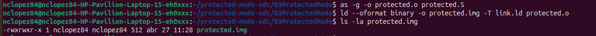

#### Inspección con objdump

Se inspeccionó el archivo objeto para ver las instrucciones con sus **direcciones relativas** (comienzan en `0x0`, antes de que el linker las resuelva):

```bash
objdump -S main.o
```

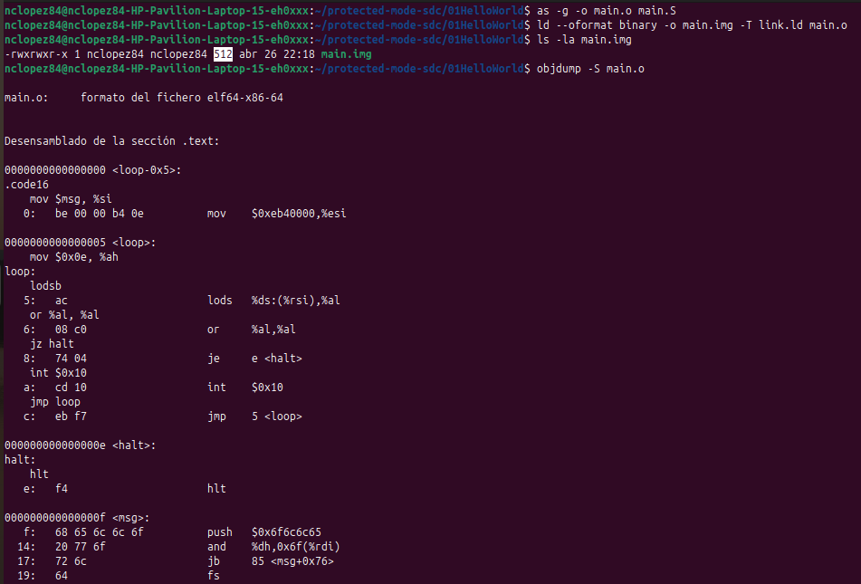

#### Inspección con hd (hexdump)

Se inspeccionó la imagen final para verificar su contenido. Se puede observar el código del programa al inicio y la **firma MBR `55 AA`** en los bytes 510-511 (offset `0x1FE`):

```bash
hd main.img
```

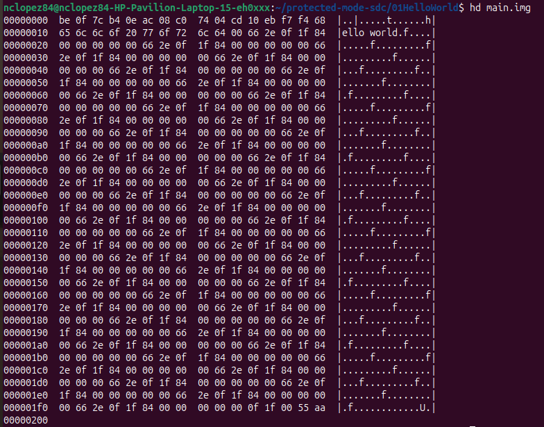

#### Ejecución en QEMU

Se ejecutó la imagen en QEMU para verificar el funcionamiento:

```bash
qemu-system-x86_64 -hda main.img
```

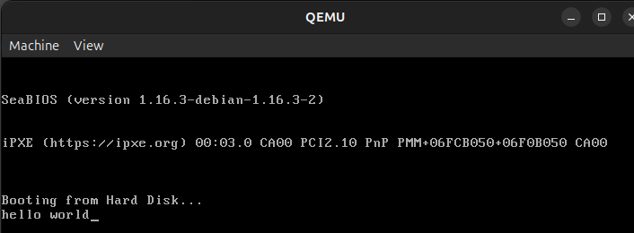

#### Intento de ejecución en hardware real (pendrive)

Se grabó la imagen en un pendrive usando `dd` para intentar ejecutarla en hardware real.

Primero se identificó el pendrive con `lsblk`:

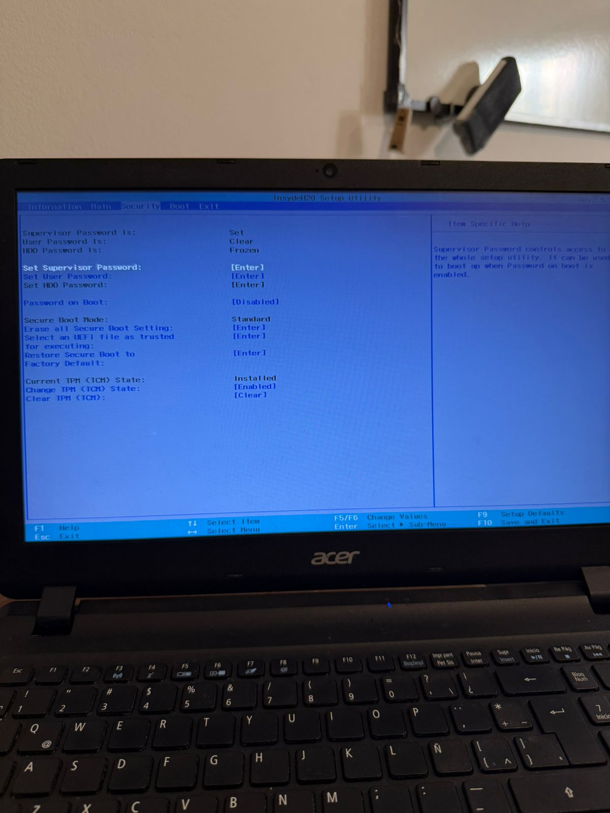

Se grabó la imagen:

```bash
sudo umount /dev/sda1
sudo dd if=main.img of=/dev/sda bs=512 count=1 conv=fdatasync
sudo sync
```


Se intentó arrancar desde el pendrive en una **HP Pavilion** (firmware UEFI). La BIOS no reconoció el bootloader MBR porque el sistema usa UEFI con Secure Boot. Se configuró la BIOS deshabilitando Secure Boot y poniendo USB Flash Drive primero en el orden de arranque, pero UEFI requiere un ejecutable EFI en una partición ESP — no un MBR legacy:

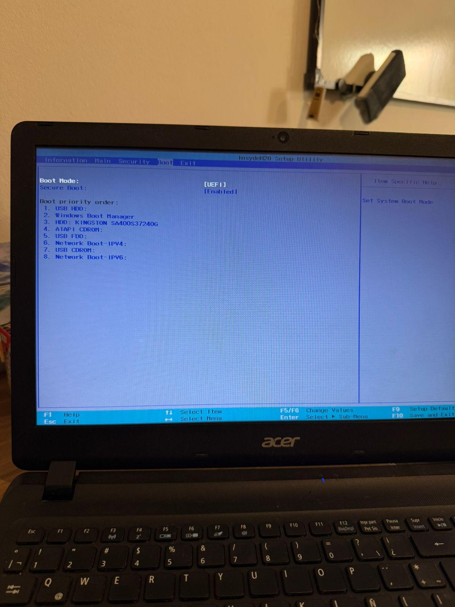

Se intentó también en una **Acer** con BIOS legacy. Se configuró Boot Mode en Legacy y USB HDD primero en el orden de arranque:

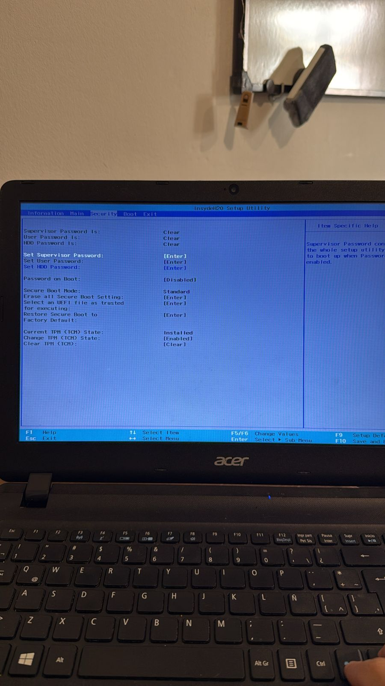
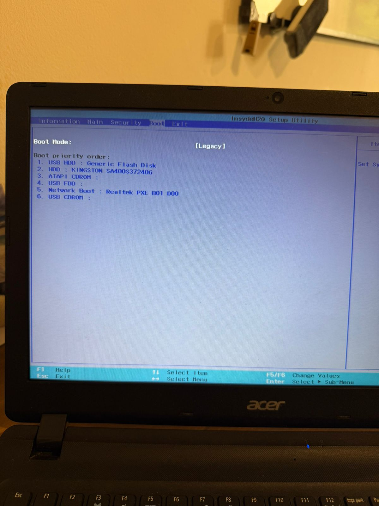

**Conclusión del intento en hardware real:** La ejecución exitosa en QEMU demuestra que el bootloader es correcto. La imposibilidad de ejecutarlo en hardware real ilustra precisamente la diferencia entre BIOS legacy y UEFI tratada en el Desafío 1: la BIOS busca la firma `0x55AA` en el MBR, mientras que UEFI busca un ejecutable PE en la ESP.

---

## Cuestionario

### Desafío 1 — UEFI y coreboot

#### ¿Qué es UEFI? ¿Cómo se usa? Función ejemplo

UEFI (Unified Extensible Firmware Interface) es el estándar moderno de firmware que reemplaza a la BIOS tradicional. Opera en modo protegido (32 o 64 bits) y expone su funcionalidad a través de una tabla de punteros a funciones, a diferencia de la BIOS que usa interrupciones de 16 bits en modo real.

Un programa UEFI se desarrolla en C usando el EDK II. El firmware provee al programa un puntero a la tabla de servicios del sistema (`EFI_SYSTEM_TABLE`) desde donde se accede a todos los servicios.

**Ejemplo de función — `OutputString()`:**

```c
SystemTable->ConOut->OutputString(SystemTable->ConOut, L"Hola desde UEFI\n");
```

Pertenece al protocolo `EFI_SIMPLE_TEXT_OUTPUT_PROTOCOL` y permite imprimir texto en la consola del firmware. El string usa formato wide (UTF-16), que es el formato nativo de UEFI.

#### Bugs de UEFI que pueden ser explotados

- **BootHole (CVE-2020-10713):** Desbordamiento de búfer en GRUB2 que permitía evadir Secure Boot y ejecutar código arbitrario antes de cargar el SO.
- **UEFI LogoFAIL (2023):** Vulnerabilidades en parsers de imágenes dentro del firmware de múltiples fabricantes (AMI, Insyde, Phoenix). Al manipular imágenes de logo en la ESP se lograba ejecución de código durante el arranque.
- **ThinkPwn (2016):** Escalada de privilegios en el SMM de equipos Lenovo ThinkPad que permitía deshabilitar Secure Boot y modificar la flash del firmware.
- **PKfail (2024):** Una clave de plataforma de prueba marcada como "DO NOT TRUST" fue incluida en cientos de dispositivos de múltiples fabricantes, permitiendo firmar bootloaders maliciosos eludiendo Secure Boot.

Estos ataques son especialmente graves porque pueden instalar bootkits UEFI que sobreviven al formateo del disco.

#### ¿Qué es el CSME y el Intel MEBx?

**CSME (Converged Security and Management Engine):** Es un subsistema independiente integrado en el chipset de Intel con su propio procesador, sistema operativo (MINIX 3) y acceso directo al hardware. Sus funciones incluyen gestión remota fuera de banda (Intel AMT), almacenamiento seguro de claves criptográficas (Intel PTT) y verificación de integridad del firmware. Ha sido objeto de vulnerabilidades críticas como CVE-2017-5689.

**Intel MEBx (Management Engine BIOS Extension):** Es una extensión de la UEFI/BIOS accesible durante el arranque (generalmente con Ctrl+P) que permite configurar el CSME: contraseña, habilitar/deshabilitar AMT, parámetros de red para gestión remota y modo de aprovisionamiento.

#### ¿Qué es coreboot? Productos y ventajas

Coreboot es un proyecto de firmware libre que reemplaza la BIOS/UEFI por una implementación mínima y auditada. Inicializa el hardware lo antes posible y delega el resto del arranque a un payload (GRUB2, SeaBIOS, etc.).

**Productos que lo incorporan:** Chromebooks y Chromeboxes de Google, laptops System76, computadoras Purism (Librem), servidores del proyecto Open Compute Platform de Facebook.

**Ventajas:**
- **Velocidad:** arranca en menos de 1 segundo
- **Código auditado:** al ser software libre puede ser inspeccionado por cualquier investigador
- **Sin CSME:** permite neutralizar el Management Engine de Intel
- **Menor superficie de ataque:** firmware mínimo sin interfaces de gestión remota
- **Flexibilidad de payload:** el usuario elige el gestor de arranque

---

### Desafío 2 — El Linker

#### ¿Qué es un linker y qué hace?

Un linker (enlazador) toma uno o más archivos objeto (`.o`) generados por el ensamblador y los combina para producir un ejecutable o imagen binaria. En el contexto de un bootloader bare-metal cumple un rol fundamental: posiciona el código en las direcciones de memoria correctas (sin sistema operativo que lo haga), agrega la firma MBR y produce una imagen binaria cruda.

#### ¿Qué es la dirección 0x7c00? ¿Por qué es necesaria?

Es la dirección física donde la BIOS carga y ejecuta el MBR. Su origen es histórico: en el IBM PC original de 1981 con 32 KB de RAM se calculó como `32KB - 512B (MBR) - 512B (datos) = 0x7C00`. Esta convención se mantuvo en todos los PCs hasta la actualidad.

Si se omitiera esta directiva en el linker script, las referencias internas del código apuntarían a direcciones incorrectas y el programa fallaría al ejecutarse.

```ld
SECTIONS {
    . = 0x7c00;   /* BIOS carga el MBR siempre en esta dirección */
    .text : { *(.text) }
}
```

#### Comparación objdump vs hd

En el archivo objeto (`objdump -S main.o`) las direcciones son **relativas** (comienzan en `0x0`). En la imagen final (`hd main.img`) el código aparece desde el byte 0, seguido de padding con ceros, y la firma `55 AA` en los últimos dos bytes del sector.

Esto confirma que el linker tomó el código con direcciones relativas, lo reubicó según el origen `0x7c00`, y generó una imagen binaria de 512 bytes lista para ser arrancada por la BIOS.

#### ¿Para qué sirve `--oformat binary`?

Instruye al linker para producir una **imagen binaria cruda** (raw binary) en lugar de un ejecutable ELF. La BIOS no entiende ELF — simplemente copia los 512 bytes del sector en RAM y salta a ejecutarlos. Sin `--oformat binary`, el primer byte sería la cabecera ELF (`0x7F ELF`) en lugar de la primera instrucción del bootloader.

---

### Desafío 3 — Modo Protegido

#### Código assembler: transición a modo protegido sin macros

Se implementó el código completo de transición desde modo real a modo protegido con dos descriptores de segmento diferenciados.

**Archivo: `protected.S`**

```asm
# protected.S — Transición a modo protegido sin macros
# Dos segmentos: código (0x08) y datos (0x10)
# Sintaxis AT&T (GAS)

.code16
.global _start

_start:
    cli                          # 1) Deshabilitar interrupciones
    lgdt gdt_descriptor          # 2) Cargar la GDT

    # 3) Activar modo protegido: setear bit PE (bit 0) en CR0
    mov  %cr0, %eax
    or   $0x1, %eax
    mov  %eax, %cr0

    # 4) Far jump: vacía el pipeline y salta a código de 32 bits
    ljmp $0x08, $protected_mode

.code32
protected_mode:
    # 5) Cargar registros de segmento con selector de datos (0x10)
    mov  $0x10, %ax
    mov  %ax, %ds
    mov  %ax, %es
    mov  %ax, %fs
    mov  %ax, %gs
    mov  %ax, %ss

    # Escribir 'P' en memoria de video VGA (0xB8000)
    movl $0x0F500000, 0xB8000

    hlt

.align 8
gdt_start:

gdt_null:                        # Descriptor 0: NULL (obligatorio)
    .long 0x00000000
    .long 0x00000000

gdt_code:                        # Descriptor 1: CÓDIGO (selector 0x08)
    .word 0xFFFF                 # Límite 0-15
    .word 0x0000                 # Base 0-15
    .byte 0x00                   # Base 16-23
    .byte 0x9A                   # Acceso: P=1,DPL=00,S=1,Type=1010
    .byte 0xCF                   # Flags: G=1,D/B=1
    .byte 0x00                   # Base 24-31

gdt_data:                        # Descriptor 2: DATOS (selector 0x10)
    .word 0xFFFF
    .word 0x0000
    .byte 0x10                   # Base 16-23 = 0x10 → base en 0x00100000
    .byte 0x92                   # Acceso: P=1,DPL=00,S=1,Type=0010 (R/W)
    .byte 0xCF
    .byte 0x00

gdt_end:

gdt_descriptor:
    .word gdt_end - gdt_start - 1
    .long gdt_start

.fill 510-(.-_start), 1, 0
.word 0xAA55
```

**Archivo: `link.ld`**

```ld
SECTIONS {
    . = 0x7c00;
    .text : { *(.text) }
}
```

**Compilación:**

```bash
as -g -o protected.o protected.S
ld --oformat binary -o protected.img -T link.ld protected.o
ls -la protected.img   # debe pesar 512 bytes
```


#### Verificación con GDB y QEMU

Se lanzó QEMU en modo debug y se conectó GDB para depurar instrucción a instrucción:

```bash
# Terminal 1
qemu-system-i386 -hda protected.img -boot c -s -S

# Terminal 2
gdb
(gdb) target remote localhost:1234
(gdb) set architecture i8086
(gdb) br *0x7c00
(gdb) c
```

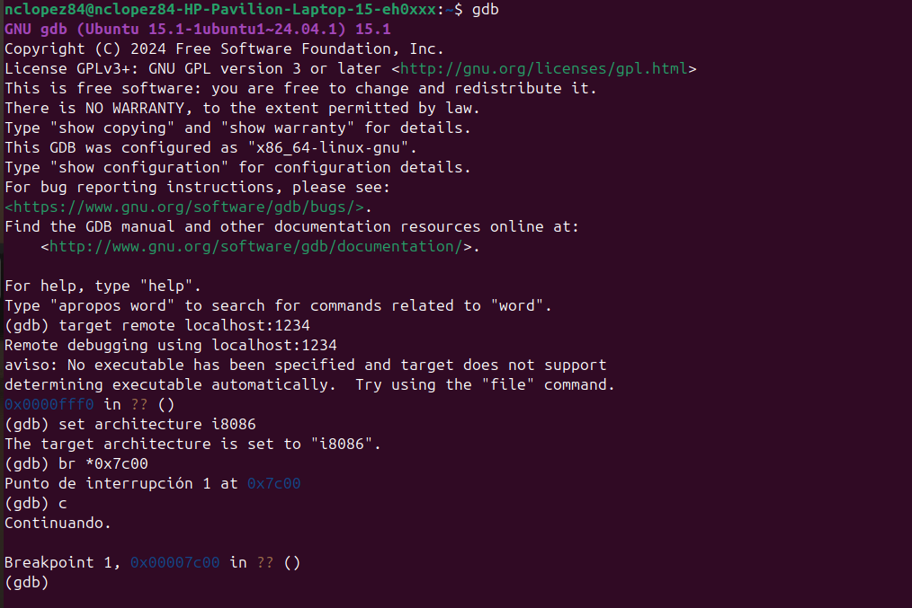

Se avanzó instrucción a instrucción con `si`. Se observa cómo las direcciones avanzan desde `0x7c00` hasta `0x7c2d` (el `ljmp`) y luego el procesador salta al modo protegido:

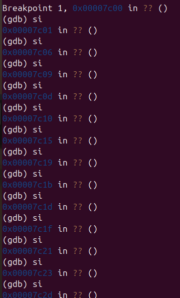

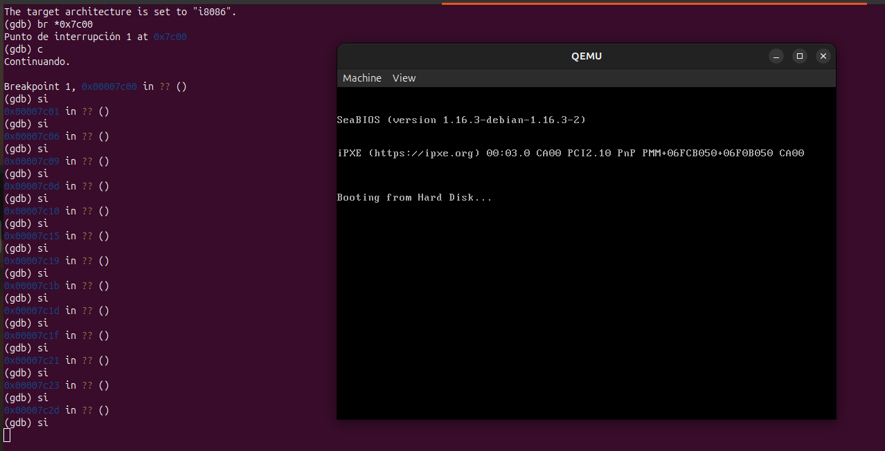

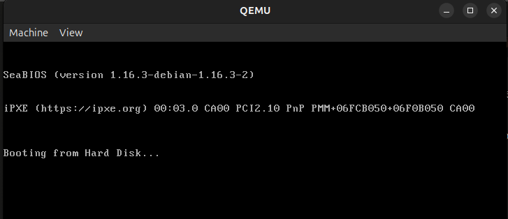

#### Dos descriptores de memoria diferenciados

El código define dos descriptores en la GDT con bases distintas:

- **Segmento de código (selector `0x08`):** base `0x00000000`, cubre todo el espacio de 4GB. Byte de acceso `0x9A` → ejecutable y legible, no escribible (Type=`1010`).
- **Segmento de datos (selector `0x10`):** base `0x00100000` (1 MB). Byte de acceso `0x92` → escribible (Type=`0010`).

La diferenciación de bases implica que la misma dirección lógica apunta a diferentes direcciones físicas según el segmento, ilustrando el mecanismo de protección de la segmentación x86.

#### Experimento: segmento de datos read-only

Se modificó el byte de acceso de `gdt_data` de `0x92` a `0x90` (bit W=0, no escribible):

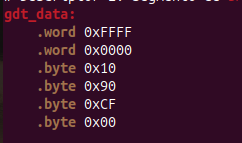

Y se agregó una instrucción que intenta escribir en ese segmento:

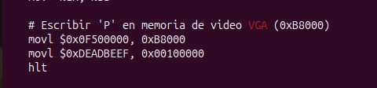

**¿Qué sucede?** Al intentar escribir en un segmento con W=0, el procesador genera una excepción **#GP (General Protection Fault, vector 13)**. Sin IDT configurada, el #GP genera una excepción de doble falta (#DF) y finalmente una **triple fault**, lo que provoca el reset inmediato de la máquina. En QEMU esto se observa como un reinicio del sistema, con GDB volviendo a parar en el breakpoint `0x7c00`:

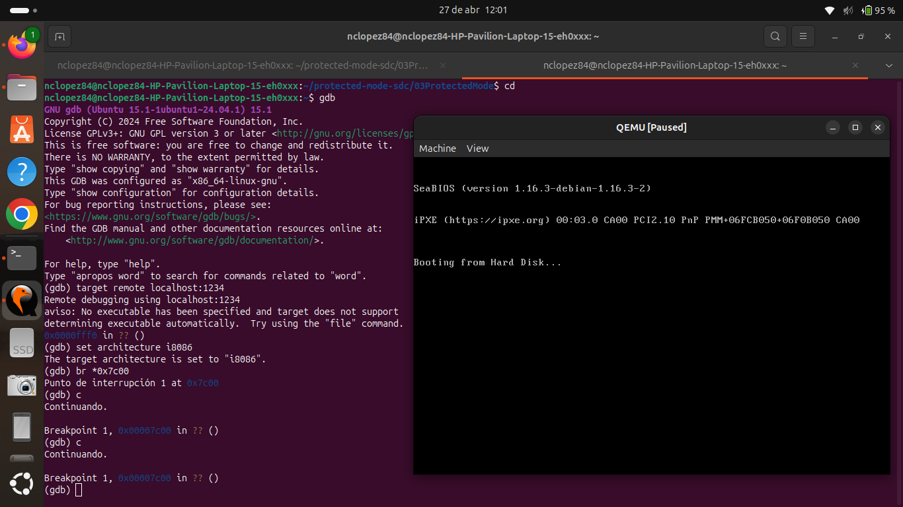

Esto confirma que el mecanismo de protección de memoria del modo protegido funciona correctamente: el procesador impide la escritura antes de que ocurra.

#### ¿Con qué valor se cargan los registros de segmento en modo protegido?

En modo protegido los registros de segmento ya no contienen direcciones directas sino **selectores de segmento** — valores de 16 bits que actúan como índices en la GDT:

```
Bits 15-3: Índice en la GDT (13 bits → hasta 8192 descriptores)
Bit  2:    TI — Table Indicator: 0=GDT, 1=LDT
Bits 1-0:  RPL — Requested Privilege Level (0=ring0, 3=ring3)
```

En el código:
- **CS = `0x08`** → índice 1 en la GDT, TI=0, RPL=00. Se carga implícitamente mediante el `ljmp $0x08`.
- **DS, ES, FS, GS, SS = `0x10`** → índice 2 en la GDT, TI=0, RPL=00. Se cargan explícitamente con `mov $0x10, %ax / mov %ax, %ds`.

Es obligatorio cargar todos los registros al entrar en modo protegido porque cada uno tiene un **registro caché invisible (shadow register)** que almacena el descriptor completo. Si no se actualizan, los cachés conservan valores del modo real que son inválidos en modo protegido.

---

## Conclusiones

Este TP permitió comprender el proceso completo de evolución de un procesador x86 desde el modo real al modo protegido. Los conceptos clave aprendidos fueron:

- La **BIOS** y su rol en el arranque legacy vs. **UEFI** como estándar moderno con mayores capacidades pero también mayor superficie de ataque.
- El **linker** como herramienta fundamental para posicionar código en direcciones específicas de memoria en entornos bare-metal.
- La **GDT** como estructura central del modo protegido: sin ella el procesador no puede operar en 32 bits.
- La **protección de memoria por segmentación**: el procesador verifica permisos antes de cada acceso y genera excepciones controladas ante violaciones.
- El uso de **QEMU y GDB** para depurar código que se ejecuta directamente sobre el hardware, instrucción a instrucción.

La imposibilidad de ejecutar el bootloader MBR en hardware moderno con UEFI ilustra concretamente la diferencia entre los dos estándares de firmware y justifica la existencia de proyectos como coreboot.
