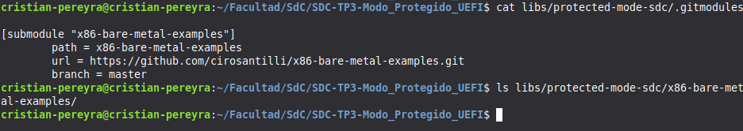
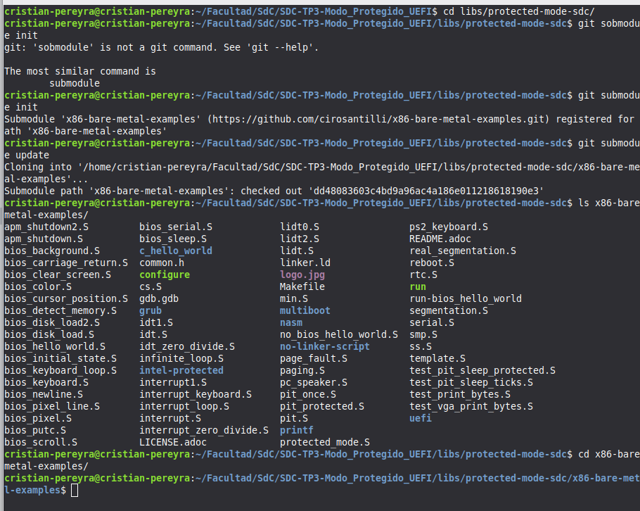
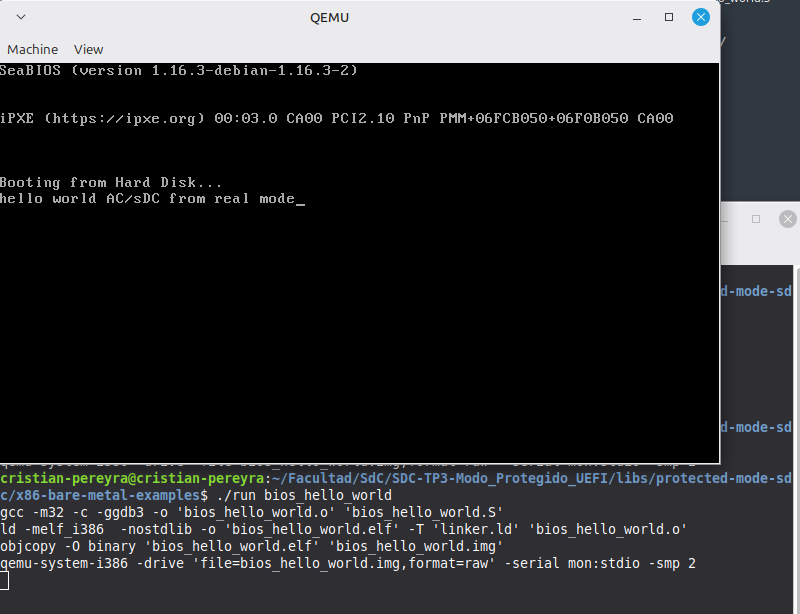
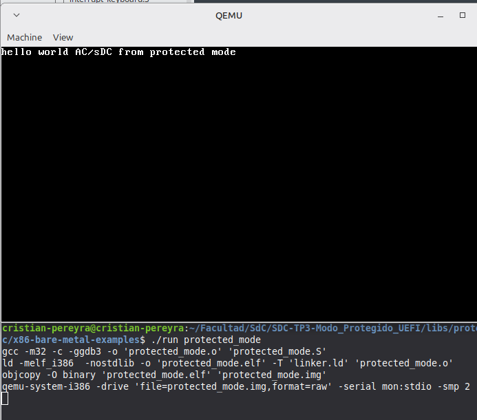
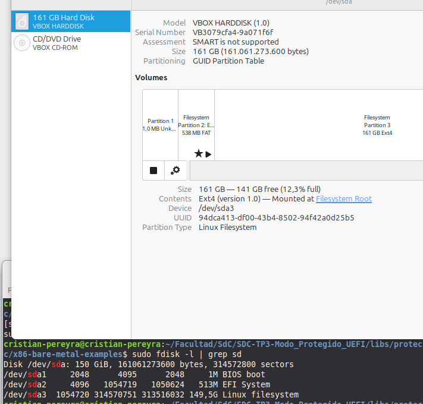

# Modo protegido

## Introducción

Los procesadores x86 mantienen compatibilidad con sus antecesores y para agregar nuevas funcionalidades deben ir “evolucionando” en el tiempo durante el proceso de arranque. Todos los CPUs x86 comienzan en modo real en el momento de carga (boot time) para asegurar compatibilidad hacia atrás,  en cuanto se los energiza se comportan  de manera muy primitiva, luego mediante comandos se los hace evolucionar hasta poder obtener la máxima cantidad de prestaciones posibles.El modo protegido es un modo operacional de los CPUs compatibles x86 de la serie 80286 y posteriores. Este modo es el primer salto evolutivo de los x86. El modo protegido tiene un número de nuevas características diseñadas para mejorar la multitarea y la estabilidad del sistema, tales como la protección de memoria, y soporte de hardware para memoria virtual como también la conmutación de tareas.

## Enunciado

[Link](https://docs.google.com/document/d/1Y-MSIlVy9gCUEqxakHh95rBnM1RaSJZYPCq-UVWYarE/edit?hl=es&tab=t.0#heading=h.cqdj6qinubi8)

En este TP ejecutaremos un trozo de código que configura nuestro procesador para llevarlo desde el modo real al modo protegido.

Antes de la clase:
* Revisar el teórico
* Clonen este repositorio e inicializan los submódulos (ver README).

https://gitlab.com/sistemas-de-computacion-2021/protected-mode-sdc

Se adjunta el manual del desarrollador para procesadores x86 de Intel.

Y un repositorio de código muy interesante para el práctico que ya está incluido en el repositorio clonado.

https://github.com/cirosantilli/x86-bare-metal-examples

Para este trabajo deberán realizar un informe que responda a las consignas que se encuentran en la presentación. Mostrar la ejecución del ejemplo en una máquina virtual explicando lo que sucede.

¿Te animas a explorar UEFI…?

si te animas podes empezar por aquí 

* https://github.com/utshina/uefi-simple/tree/master 
* https://wiki.osdev.org/UEFI_App_Bare_Bones 


## Cuestionario

- Crear un código assembler que pueda pasar a modo protegido (sin macros).

Para pasar a modo protegido necesitas tres cosas: una GDT definida, cargarla con lgdt, y activar el bit PE de CR0.

````asm
.code16
.global _start
_start:
    cli                         # 1. Desactivar interrupciones
    lgdt gdt_descriptor         # 2. Cargar la tabla de segmentos

    mov %cr0, %eax
    or $0x1, %eax               # 3. Activar bit PE (Protection Enable)
    mov %eax, %cr0

    ljmp $0x08, $next_step      # 4. Far jump para limpiar el pipeline (CS = 0x08)

.code32
next_step:
    mov $0x10, %ax              # Cargar selectores de datos (GDT index 2)
    mov %ax, %ds
    mov %ax, %ss
    # ... aquí ya estás en modo protegido ...
    jmp .

# ESTRUCTURA DE LA GDT
gdt_start:
    .quad 0x0                   # Descriptor nulo (obligatorio)
gdt_code:                       # Selector 0x08
    .word 0xffff, 0x0000, 0x9a00, 0x00cf
gdt_data:                       # Selector 0x10
    .word 0xffff, 0x0000, 0x9200, 0x00cf
gdt_end:

gdt_descriptor:
    .word gdt_end - gdt_start - 1
    .long gdt_start

.org 510
.word 0xaa55
```

- ¿Cómo sería un programa que tenga dos descriptores de memoria diferentes, uno para cada segmento (código y datos) en espacios de memoria diferenciados? 

En el ejemplo anterior, ambos segmentos tienen Base 0 y Límite 4GB (se solapan). Para que sean diferenciados, cambias la Base en la GDT:
* Descriptor Código: Base 0x00000000, Límite 0x000FFFFF.
* Descriptor Datos: Base 0x00100000, Límite 0x000FFFFF.

Si el segmento de datos empieza en 0x00100000, cuando el programa intente escribir en la dirección lógica 0x0, el hardware escribirá en la física 0x00100000. Esto es Segmentación Pura.

- Cambiar los bits de acceso del segmento de datos para que sea de solo lectura,  intentar escribir, ¿Que sucede? ¿Que debería suceder a continuación? (revisar el teórico) Verificarlo con gdb. 

Si cambias el byte de acceso del descriptor de datos de 0x92 (Lectura/Escritura) a 0x90 (Solo Lectura):

* ¿Qué sucede?: Al intentar hacer un mov %eax, (%ebx), el procesador detecta que el descriptor apuntado por el registro de segmento tiene el bit de escritura en 0.
* ¿Qué debería suceder a continuación?: El procesador lanza una Excepción de Protección General (#GP / General Protection Fault).
* Verificación con GDB: En QEMU, puedes usar info registers o maintenance packet qRcmd,info-registers. Verás que el registro EIP deja de avanzar y el procesador entra en un bucle de excepción o se detiene. Si tienes un manejador de excepciones, verás que el código de error en el stack apunta al selector que causó el fallo.

- En modo protegido, ¿Con qué valor se cargan los registros de segmento ? ¿Porque? 

## Laboratorio: Compilar y correr una aplicación sin SO

* **Parte 1 – Clonar el repositorio Git y el submódulo**

[path al modulo clonado](../libs/protected-mode-sdc)

* **Paso 2: Trabajando con submódulos.**






* **Parte 2: Compilar y ejecutar los ejemplos**





* **Parte 3: Grabar la imagen y correrla en HW real (Se usa vBox)**

[Link al video deon se carga la vm con protected.img](https://drive.google.com/file/d/1YpCq4X7zdX75tpLB3bAOjuOSMB27jK2I/view?usp=sharing)



1. ¿Se verá afectado el disco de mi PC real? 

No, siempre y cuando selecione la letra correcta. Al estar dentro de una máquina virtual (Mint), el sistema operativo solo ve los dispositivos que la VM le permite ver. El /dev/sdX que ve Mint es un disco virtual (un archivo .vdi o .vmdk en tu Windows).

Peligro: Si por algún error de configuración hubieras montado su disco físico de Windows dentro de la VM (passthrough), entonces sí. Pero por defecto, en VirtualBox/VMware, solo tocas el disco virtual.

2. ¿Se verá afectado el arranque de mi Windows?

No. Windows vive en el disco físico de tu computadora. Tu comando dd afectará únicamente al registro de arranque (MBR) y los sectores del disco virtual de la VM. Windows ni siquiera se enterará de que esto está pasando.

3. ¿Qué va a pasar con la VM cuando grabe y ejecute esto?
Aquí es donde la cosa se pone interesante:

Sobreescritura total: Si protected_mode.img es una imagen de un sector de arranque, borrarás el GRUB de Linux Mint.

Mint dejará de arrancar: La próxima vez que reinicies la VM, ya no entrarás a Linux Mint. En su lugar, se ejecutará el código de tu imagen.

Pérdida de datos: Si la imagen .img es grande, sobreescribirá la tabla de particiones y tus archivos de Mint. Si es solo de 512 bytes, solo destruirá el arranque de Mint, pero tus archivos seguirán ahí (aunque inaccesibles sin reparar el boot).